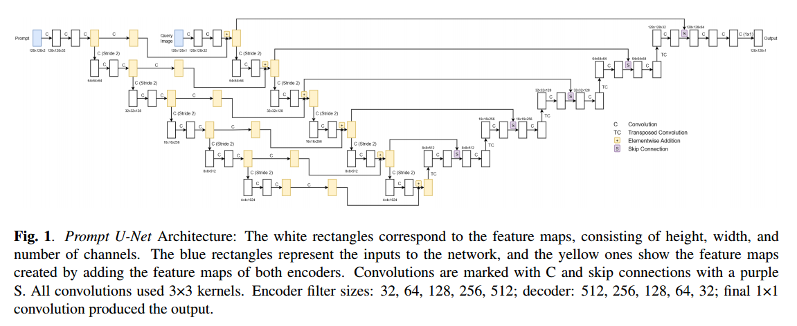
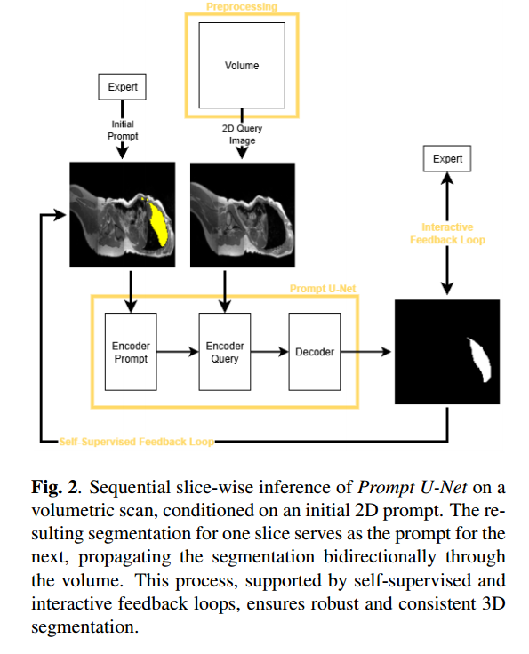

# Prompt U-Net: Clinician-Guided AI for Context-Aware Segmentation 

> **"A leap towards generalizable, lightweight, and user-controllable AI in clinical workflows."**

## Scientific Core Innovation
Prompt U-Net transforms static segmentation into an **interactive, context-aware process**. Unlike "black-box" models, it leverages **In-Context Learning** to adapt to unseen anatomical structures using minimal data, while beating important baseline models.

Due to its architectural design, the architecture achieves significantly lower computational complexity and a reduced memory footprint compared to established baselines. These optimizations make Prompt U-Net uniquely suited for real-time, in-browser inference, bringing high-performance AI directly into clinical and laboratory workflows with zero installation.

---

## Deployment: Clinical Accessibility via TF.js
To bridge the gap between research and clinical application, this project is deployed using **TensorFlow.js**. We prooved that compared to heavy models it's possible to run

**Why this matters for Clinicians/Researchers:**
1. **Zero-Setup:** No Python/Docker/GPU drivers needed. Works instantly in any browser.
2. **Data Privacy:** Full **client-side inference**. Medical data never leaves the local machine.
3. **Lab-in-the-loop:** Perfect for real-time interaction during imaging or screening.

---

## Interactive Demo & Tutorial
*(Hier dein Video einfügen, das zeigt, wie der User durch Prompts die Segmentierung steuert)*

---

## Features:
- **Dual-Encoder Architecture:** Simultaneously processes medical images and 2D user-provided prompts.
- **In-Context Learning:** Enables rapid adaptation to new tasks without retraining.
- **Self-Supervised Feedback (SSF):** Automatically ensures volumetric consistency. The model uses its own predictions from adjacent slices as internal "context" to refine the current segmentation without human intervention.
  *   *Note: While a core part of the research paper for 3D consistency, SSF is not yet included in the Browser Demo.*
- **Interactive Feedback (IF):** Enables "Lab-in-the-loop" refinement. A clinician can provide a manual correction on a missegmented area, which is fed back into the dual-encoder to instantly update and improve future masks.
- **Data Efficiency:** Outperforms established baselines with reduced data requirements.

### Technical Documentation & Publication
For an in-depth discussion of the methodology, loss functions, and initial benchmark results, please refer to our preprint:

**[Link to Paper / Preprint Placeholder]**

> **Note on Project Evolution:** 
> This project is under active development. While the preprint provides the foundational scientific framework, the current implementation (especially the TF.js web version) has evolved further. The future publication will include architectural refinements and further research on e.g. computational complexity and memory foorptint. 
